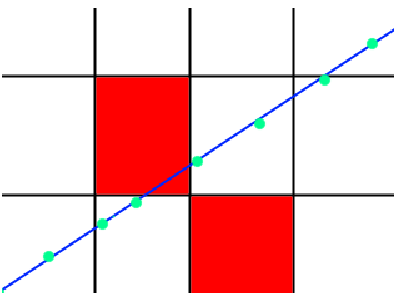

# p5raycaster
"raycaster" made in p5
# Abstract
Det ønskedes at udvikle en ’graphics engine’, der kunne bruge raycasting til at render et pseudo-
3d miljø. Programmet blev udviklet i p5.js, og det lykkedes at lave et program, der kunne render
et miljø, der bestod af en række af kvadratiske celler, der var udfyldt med slags vægge.
# Indledning/beskrivelse
Der findes mange måder at render grafik på, og nogle kræver mere regnekraft end andre.
Raycasting er en simpel form af raytracing, der kun udsender en ’ray’ for hver horisontalle i
synsfeltet, i stedet for en ’ray’ for hver stråle. Ved at man udregner hvornår ens ’ray’ skærer en
væg, kan man finde ud af hvor langt væk væggen er, og dermed varierer hvor meget den fylder i
ens synsfelt. Jeg valgte at lave programmet i p5.js biblioteket til JavaScript, da p5 egner sig vel
udvikling af grafik. Valget af p5.js uddybes yderligere senere
# Problemformulering
Hvordan kan man udvikle en raycaster i p5.js?
Yderligere krav fra projektbeskrivelsen følger:
## Need to have
### Raycasting
Der skal involvere en eller anden form for udkastning af stråle, der skærer et objekt
### Konfigurerbar ”level”
Man skal kunne ændre på, hvordan miljøet ser ud.
### Bevægeligt kamera
Man skal kunne bevæge sig rundt i miljøet, og kameraet/perspektivet skal ligeledes ændre sig
### Forskellige farver for overflader
Man skal kunne se forskel på forskellige slags overflader, og de skal ’shades’ angående hvilken
akse fladen lægger parallelt med.
## Nice to have
### Raytracing, 3D (svært)
I stedet for at lave raycasting, der kun sender 1 stråle pr 1 x, så lave ray tracing, der sender en
stråle for hver pixel ( x*y). Det er mere intensivt på computeren, og meget sværere at
programmere
### Reflektioner (svært)
Tilhørende raytracing, kræver det at man holder styr på, hvilke flader strålen rammer, og hvad
opacitet/reflektivitet af forskellige flader er.
### Fjendtlig AI og våben
Fjender, som kan skyde på en, og som man selv kan skyde på.
### Objectives
Det kunne være, at man skulle samle objekter ind, for at få point, eller dræbe alle fjender
### Menu
En menu, der tillader en at gå ind og ud, og ændre indstillinger
### Højdeforskel, 3d vægge
At man skal kunne lave etageskift, ligesom i DOOM(1993).
### Textures
At i stedet for at render væggene med linjer, så opdeler man linjerne, så de danner en texture
angående hvilken slags flade man ser.
### Random maze generation
At generere layoutet af miljøet tilfældigt, så det ikke er forudindstillet. Det kunne udvikles
yderligere, ved at bruge en maze-algorithm, så man er sikker på at der er en rute fra den ene ende
til den anden ende af miljøet.
# Teori
## Raycasting
Jeg henviser til https://lodev.org/cgtutor/raycasting.html for teori om raycasting
# Beskrivelse af udviklingsprocessen
## Tilgang
Jeg valgte p5.js biblioteket for JavaScript, da det er et bibliotek/sprog, der gør det nemt at lave
grafik. Da det er JavaScript er det nemt at køre i browseren, som gør det nemt at arbejde på tværs
af PC’er og dele det med andre. Der er muligt at køre programmet på en liveserver, så man kan
compile koden mens man skriver den. Det giver et godt overblik over hvad man laver, mens man
laver det. JavaScript er ikke nødvendigvis et særligt hurtigt eller optimeret sprog, men der er
meget online dokumentation og støtte til det. Det opfordrer også mere til, at man skal
programmere optimalt, hvis sproget kan begrænse hastigheden. JavaScript er ikke et
objektorienteret sprog, på samme måde som for eksempel Java er. Derfor har jeg heller ikke
valgt at programmere objektorienteret, men nærmere funktionsorienteret, hvis noget.
## Raycasting metoder
Der er flere forskellige måder at lave raycasting på, så først ledte jeg efter forskellige måder jeg
kunne gå til det. Hvis vi først kigger på hvordan vi finder ud af, hvor strålen skærer en væg:
### • ’Incremental’
Her tager vi retningsvektoren af vores stråle, og gør den lidt længere ved hvert increment.
Ved hvert increment, tjekker vi så om den skærer en af væres vægge, og hvis den ikke gør, så
gør vi strålen lidt længere igen.
Dette er meget ineffektivt, da det kræver rigtigt mange increments. Det er også muligt, at
hvis det er hjørnet af en celle, så springer den over væggen, uden at vi overhovedet ser at
den skærer.

Hvis de grønne prikker er hvert increment, den blå linje vores stråle, og de røde celler vægge,
så vil vi ikke se at strålen rammer væggen, da increment sprænger væggen over.
### • Nearest-neighbour algorithm
Her finder vi ud af hvilke linjer vores stråle skærer, ved at bruge en nearest-neighbour
algorithm. Denne blev ikke undersøgt meget
### • ***Digital Differential Analyser***
Dette er en noget mere kompliceret form for matematik, end de to andre, som bruger
differentiering til at finde en hældning af linjen i x- og y-retning. Den kan så finde ud,
angående hvilken hældning der er størst, om den næste celle linjen skærer kommer til at være
i x-retning eller y-retning. Siden at den kun har brug for at udregne overgangene mellem
vores celler, kræver det meget mindre regnekraft end de to andre metoder. Når den er nået til
en ny celle, tjekker den om cellen indeholder en væg. Hvis cellen indeholder en væg, bruger
vi længden af strålen til cellen for at udregne størrelsen af væggen på skærmen. Det var
denne metode jeg valgte at bruge.
# Funktionsbeskrivelse
Overordnet er programmet et ”spil”, hvor man kan samle blokke op, og placere dem igen.
Programmet er delt op i 5 hovedfunktioner: Menu, UI, 3D, 2D og keyHandler.
Menuen bruges til at vælge om man vil have uendelige blokke.
UI bruges til at vise, hvor mange blokke man har, og vise hvilken blok man har valgt.
2D er den nederste halvdel af skærmen, og bruges til at vise et 2D ”minimap” af banen og
spillerens placering.
3D er den øverste halvdel af skærmen, og er der hvor raytracing indgår.
keyHandler bruges til at styre kameraet frem og tilbage, og rotere venstre og højre. Den bruges
også til at placere, fjerne og skifte blokke.
Controls er således:
W,A,S,D: Kamera
Q, E: Skift Blok
Space: Placer blok
Shift: Fjern blok
